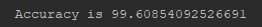
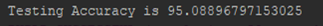

# DigitRecognizer :100:
This is a multillayer perceptron model that recognizes handwritten digits from the UCI Optical Recognition of Handwritten Digits Data Set

It was implemented from scratch in jAVA
* The input layer of the network consists of 64 inputs read from the training/testing files. The hidden layer consists of 370 perceptrons, all taking input from the input layer, with the output of each going through the sigmoid activation function. The output layer consists of 10 perceptrons whose inputs are the 370 outputs from the hidden layer, with each perceptron giving 1 output, which is then passed through an activation function. The 10 outputs of the output layer are the digits 0 to 9.
* It had mindblowing training and testing accuracies of 99.60% and 95.08! 
* Think i'm capping? check it out yourself :point_down:
* Training Accuracy: 
* Testing Accuracy: 

I know what you're thinking, this guy probably just photoshopped these stats to look cool. Okay okay, run it for yourself then :smirk:

###########################################

THINGS YOUR'RE GONNA NEED:

1. A JAVA SDK on your machine
2. An early draft of your apology letter for doubting me

And that's it! 
